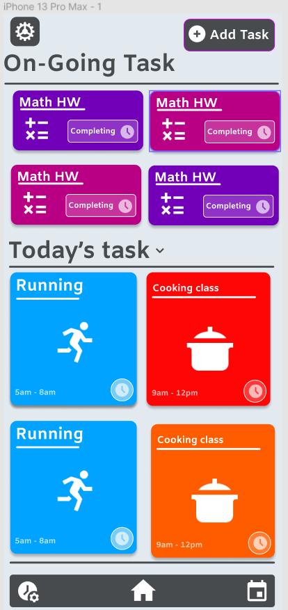

# Flexio

## <em><u>Description:</u><em>  

&nbsp; &nbsp; &nbsp; &nbsp; &nbsp;&nbsp; Flexio is a <b>simple</b>, <strong>enjoyable</strong>, and <strong>simple-to-use</strong> tool that allows you to manage your tasks and sync them with third-party apps to increase your daily productivity.

 
 

    

## <em><u>Features:</u><em>  

&nbsp; &nbsp; &nbsp; &nbsp; &nbsp;&nbsp; - <b>Simple</b> interface 
&nbsp; &nbsp; &nbsp; &nbsp;- <b>Easy</b> to use 
&nbsp; &nbsp; &nbsp; &nbsp;- <b>Simple</b> to manage 
&nbsp; &nbsp; &nbsp; &nbsp;- <b>Sync</b> within seconds 
&nbsp; &nbsp; &nbsp; &nbsp;- <b>Connect</b> with 3rd party services 

 
 

## <em><u>Installation:</u><em>  

&nbsp; &nbsp; &nbsp; &nbsp; &nbsp; &nbsp;- <b>Download</b> the app from the <a href="" style="color: #00A3FF;">App Store</a> or <a href="" style="color: #3DDC84;">Google Play</a> 
&nbsp; &nbsp; &nbsp; &nbsp;- <b>Install</b> the app on your device 
&nbsp; &nbsp; &nbsp; &nbsp;- <b>Open</b> the app 
&nbsp; &nbsp; &nbsp; &nbsp;- <b>Enjoy</b> the app 

 
 

<h1>Development</h1>

## <em><u>Platforms:</u><em>  

 

 <li style="font-size:1.2rem">Android/IOS</li>
 <li style="font-size:1.2rem">Web + pwa</li>

     
     

<h2><em><u>Apps details :-</u></em></h2>
 

## <em>Mobile</em>

 

    <li>App type : Hybird</li>
    <li>Framwork : React Native</li>
    <li>Version : 0.0.1</li>
    <li>Language : Typescript</li>
    <li>Node : 16.13.1</li>
 

 
 

## <em>Website</em>

        <li>App type : Web + pwa</li>
        <li>Framwork : Next JS</li>
        <li>Version : 0.0.1</li>
        <li>Language : Typescript</li>
        <li>Node : 16.13.1</li>
    

